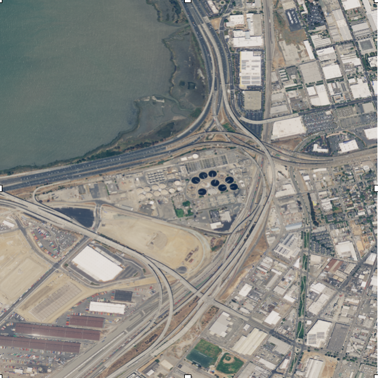
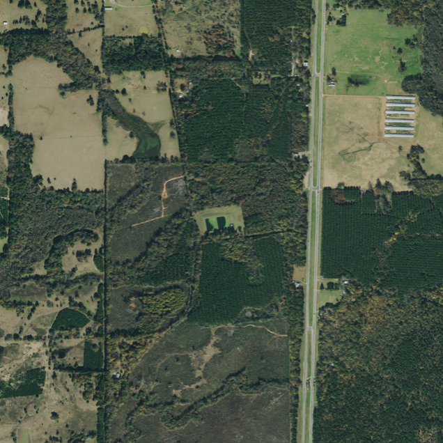
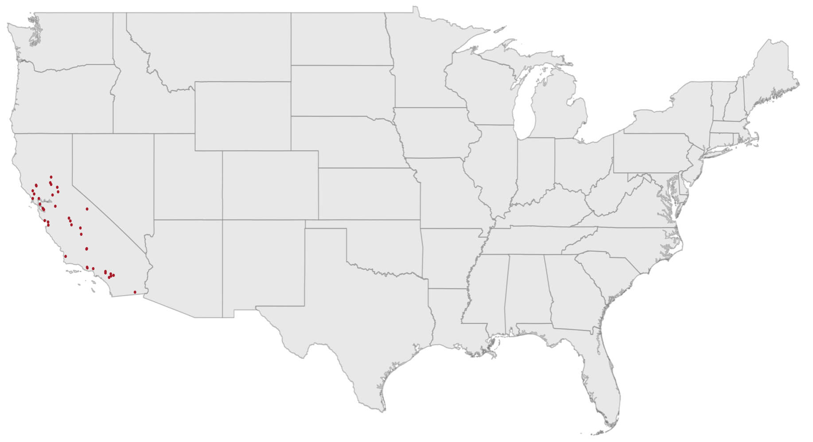
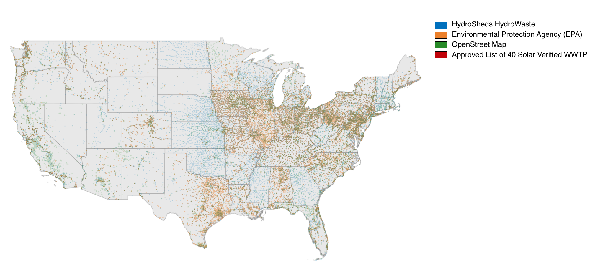
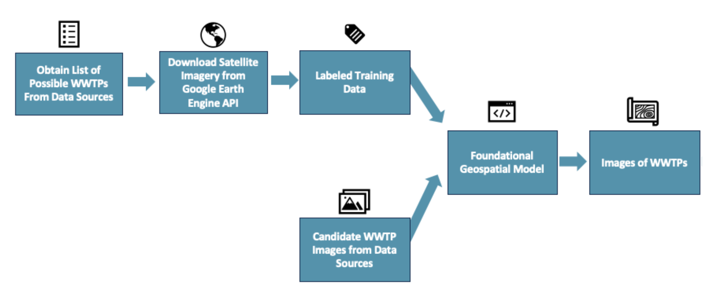
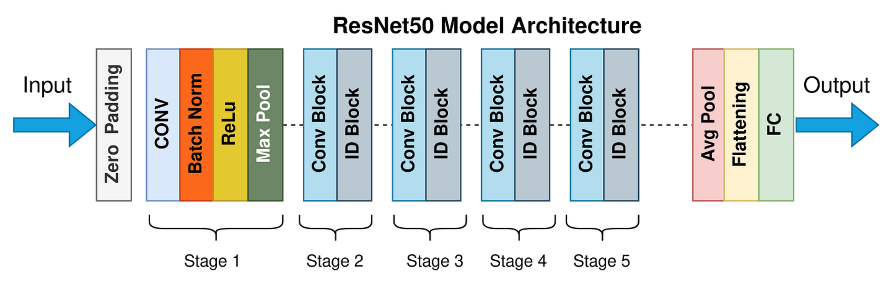
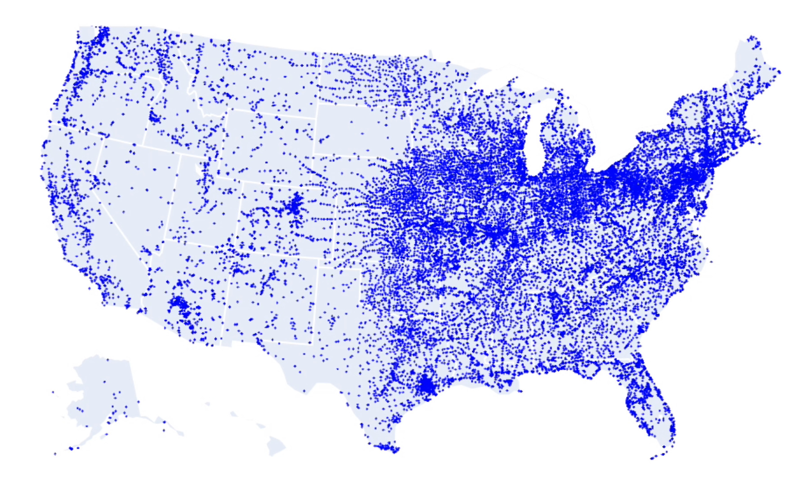
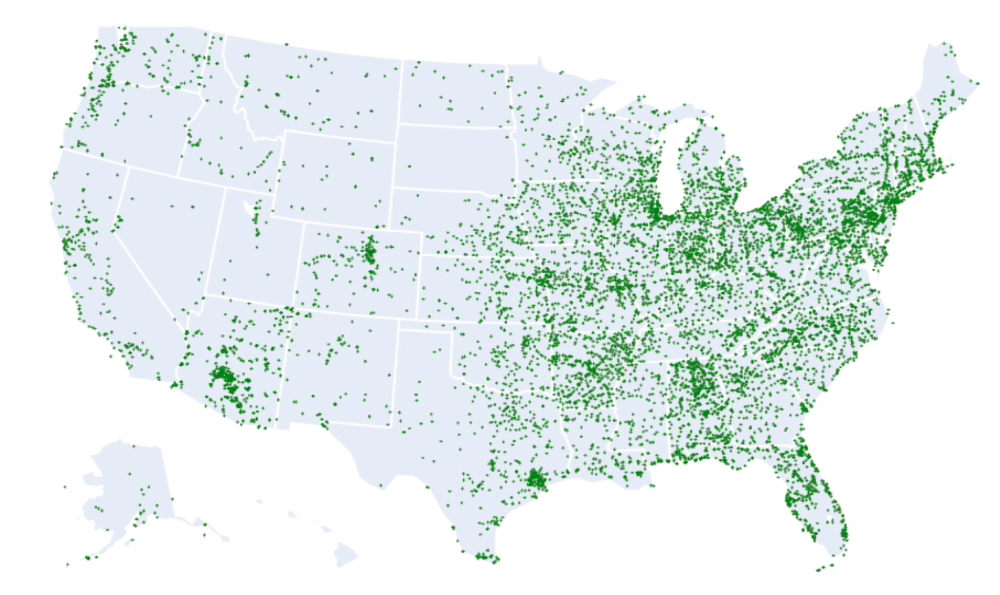
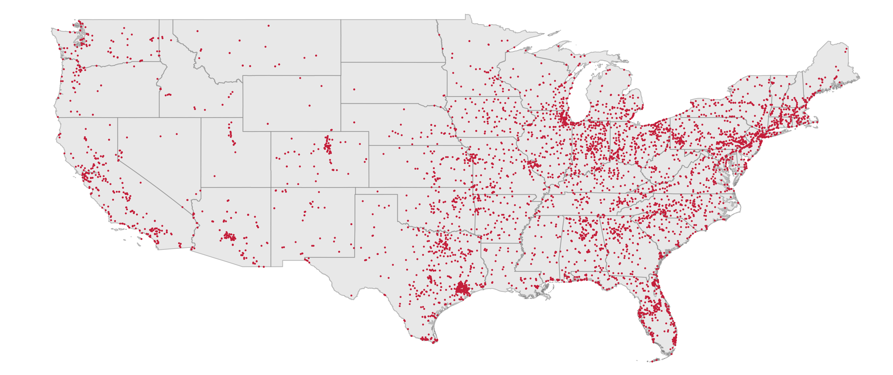

# Solar Adoption in the United States Wastewater Sector

[](https://github.com/Yer1k/solar_wastewater/actions/workflows/main.yml)

## Table of Contents
1. [Introduction](#Introduction)  
2. [Data Sources](#DataSources)   
   2.1 [Data Provided By Client](#ClientData)  
   2.2 [OpenStreetMap](#OSM)  
   2.3 [EPA](#EPA)  
   2.4 [HydroWaste](#HydroWaste)  
3. [Methodology](#Methodology)  
   3.1 [Overview](#MethodologyOverview)  
   3.2 [Process Diagram](#ProcessDiagram)  
5. [Experiments](#Experiments)  
   5.1 [Overview](#ExperimentOverview)  
   5.2 [Models](#Models)  
   5.3 [Metrics](#Metrics)  
6. [Results](#Results)
5. [Conclusion](#Conclusion)  
7. [Resources](#Resources)  
8. [Members](#Members)

## Introduction <a name="Introduction"></a>
Wastewater treatment plants act as the largest energy consumers for many municipalities across the United States, requiring 30-40% of the total energy accounted for by local governments and accounting for a large portion of the operating costs at wastewater treatment plants. According to the Department of Energy, “across the country, municipal wastewater treatment plants are estimated to consume more than 30 terawatt-hours per year of electricity, which equates to about $2 billion in annual electric costs” (Department of Energy [1]). However, there are efforts to curtail this and decrease operating costs by increasing renewable energy resources at these sites, mostly in the form of solar panels. While there is great optimism about using renewable resources to make wastewater treatment plants more energy-independent, our understanding of the extent and magnitude of current solar energy adoption in these plants remains constrained due to the unavailability of an exhaustive database of wastewater treatment plants and the status of their solar energy usage. This project is conceived to bridge this critical data gap that currently exists by addressing the research question: What is the scope and scale of solar energy adoption at wastewater treatment plants (WWTPs) in the United States, in particular within California and Texas? The answer to this question will enable government officials and researchers, like our client Dr. Christine Kirchoff and her team, to understand energy consumption levels pre- and post-solar adoption, potential energy savings, and identifying future potential candidates for adoption of solar energy.

To address this question, we leveraged and added to the existing data on wastewater treatment plants provided by our client. This project will subsequently result in a database of WWTPs within the United States including information of WWTPs with solar adoption and those without.

## Data Sources <a name="DataSources"></a>

### Data Provided by Client <a name="ClientData"></a>

The data provided by our client consisted of 40 WWTPs in California that were manually verified. The data can be found [here](https://docs.google.com/spreadsheets/d/1KJWr7KgCWb3UbIloUKGWdei0qoXiaiwe/edit?usp=share_link&ouid=110726489657206269464&rtpof=true&sd=true).

### OpenStreetMap (OSM) <a name="OSM"></a>

OpenStreetMap (OSM) is a free and open geographic database that is built through crowdsourcing, in which the community adds, updates, and maintains the tagging of facilities across the United States. Since all geographic structures in OSM's database are tagged, we filtered for wastewater treatment plants using the tag "man_made"="wastewater_plant". This resulted in 14,282 possible WWTPs. Although the abundance and accessibility of the data are advantageous, upon closer examination, we discovered discrepancies between this data from OSM and our client's specific criteria for wastewater treatment plants (WWTPs). Despite the extensive nature of the data in OpenStreetMap (OSM), it did not fully align with our client's definition of WWTPs. More information can be found [here](#osm-ref).

### Environmental Protection Agency (EPA) <a name="EPA"></a>

Upon recognizing the discrepancies and errors within OpenStreetMap (OSM), we found it essential to the success of our project and ultimate end-goal to augment our data with data from additional data sources. We used a WWTP dataset published by the Environmental Protection Agency (EPA) with information relating to location and facility identification from the EPA's Facility Registry Service (FRS) from the year 2020. The size of this dataset was 14,327 possible WWTPs. While we expected this data to be more credible due to the verified nature of the source (EPA being a government agency), after analysing the data, we found that there were entries tagged incorrectly similar to the discrepancies found within OSM, with geographic structures like forests and ponds tagged as wastewater treatment plants. More information can be found [here](#epa-ref)

### HydroWaste <a name="HydroWaste"></a>

The third and last data source our team leveraged for the creation of our extensive database was HydroSheds HydroWaste. This is an open-source spatially explicit global database of 58,502 wastewater treatment plants (WWTPs)​ and various other characteristics such as population served, amount of wastewater discharged, dilution factor of nearby water bodies that wastewater is discharged into, etc. After filtering for United States, this resulted in 14,748 possible WWTPs. Similar to the OSM and EPA datasets, after analysing the data, we found that there were entries tagged as wastewater treatment plants but were not. More information can be found [here](#hydrowaste-ref).

Below is an example of images that demonstrate the incorrect tagging from the above three data sources:

True WWTP



Falsely Labeled as WWTP



After merging the four datasets, we had 40,397 possible WWTPs.

Below is a map of the WWTPs with solar provided by the client:



Below is a map of the possible WWTPs after merging all datasets:



As can be seen from the above image, there are two aspects to this map that were noticed by our team (and may be seen by you as the reader of this project):

1) There is significant overlap amongst the data sources, which indicates that to ensure we obtain a single source of truth, we must deduplicate common WWTP records
AND
2) There are WWTPs that do not overlap, which indicates that none of the datasets are comprehensive.

## Methodology <a name="Methodology"></a>

### Overview <a name="MethodologyOverview"></a>

Since the number of possible WWTPs from the different sources are too many to manually verify for true WWTP and solar presence, we manually verified and tagged the possible WWTPs from all three data sources for California and Texas, as they were of primary importance to our client. This manual activity resulted in the identification of close to 900 correctly tagged wastewater treatment plants and close to 4,600 incorrectly tagged wastewater treatment plant locations. We used this as the training dataset for our scene binary classification model and used the trained model to predict the presence of WWTP in the images for other states. Upon running our model on the remaining ~35,000 possible wastewater treatment plants for the remaining 48 states, our model predicted the detection of ~11,000 WWTPs nationwide. Using this predicted list, we manually verified the list for all true WWTPs and the presence of solar, resulting in ~6,000 WWTPs and ~200 WWTPs with solar.

### Process Diagram <a name="ProcessDiagram"></a>



## Experiments <a name="Experiments"></a>
In this section, we will dive deep into our experimentation process.

### Overview <a name="ExperimentOverview"></a>

We not only needed to find the best model parameters for our training data but also test if a model trained on California and Texas would perform well for other states. We came up with two stages to our experiments.

#### Stage 1: Parameter Tuning 

Here we try different parameter settings to determine which set of parameters perform best on the training data. We choose the model with the highest max F1 score and AUC score.
Further information on parameters used and results can be found [here](10_code/README.md).

#### Stage 2: Within Domain vs Cross Domain Performance

Within domain refers to training and testing on the same state. Cross domain refers to training and testing on different states.
Here we perform within domain vs cross domain performance experiments to ensure good cross domain performance. We do this because WWTPs in different states may look different from each other and we want to ensure that training on California and Texas would generalize well to other states.
Further information on parameters used and results can be found [here](10_code/README.md).

### Models <a name="Models"></a>

The model used was ResNet50. ResNet50 is a specific type of convolutional neural network. It provides the option to add more convolutional layers to a CNN, without running into the vanishing gradient problem, using the concept of shortcut connections. A shortcut connection “skips over” some layers, converting a regular network to a residual network. The 50-layer ResNet uses a bottleneck design for the building block. A bottleneck residual block uses 1×1 convolutions, known as a “bottleneck”, which reduces the number of parameters and matrix multiplications. This enables much faster training of each layer.

Below is the architecture of ResNet50:



### Metrics <a name="Metrics"></a>

1. F1 Score: The F1 score is a measure of a model's accuracy that combines the precision and recall scores. It is calculated as the harmonic mean of precision and recall. The relative contribution of precision and recall to the F1 score are equal. 
The F1 score can range from 0 to 1, with a higher score indicating better model performance.

``` math
F_{1}=\frac{\text{Precision} \times \text{Recall}}{\text{Precision} + \text{Recall}}
```

2. AUC: The Area Under the Curve (AUC) is the measure of the ability of a binary classifier to distinguish between classes and is used as a summary of the ROC curve.
The higher the AUC, the better the model’s performance at distinguishing between the positive and negative classes.

## Results <a name="Results"></a>

After merging all the datasets we had 40,397 possible WWTPs.



After running model inference, we have 11,092 predicted WWTPs.



The comprehensive, predicted list of WWTPs across United States can be found [here](https://drive.google.com/drive/folders/1Ci7mXguTFOtjgDl0OTZ5oUhmNhh5Iw0R?usp=drive_link).

## Conclusion <a name="Conclusion"></a>

The final step to our project has been verifying the predicted list of WWTPs across the United States that we received from our model inference. This verification was comprised of two steps: 

1) Analyzing the images for WWTPs to determine between the prediction provided from our model was accurate
AND
2) Analyzing the images for solar identification

Upon getting the prediction from our model, we proceeded with this verification process and found that across the United States, there are ~6,000 wastewater treatment plants, of which ~200 utilize solar energy to power operations.



Our report conclusion also outlines future activities as well as the implications of economic diversity and placement of solar within affluent communities compared to within impoverished communities across the United States. In doing so, as mentioned within the Introduction, government officials and researchers, like our client Dr. Christine Kirchoff and her team, will now be able to leverage our comprehensive database to understand energy consumption levels pre- and post-solar adoption, potential energy savings, and identifying future potential candidates for adoption of solar energy and answer the desired research question: *What is the scope and scale of solar energy adoption at wastewater treatment plants (WWTPs) in the United States?*

## Resources <a name="Resources"></a>
1. [Department of Energy. (n.d.). Wastewater Infrastructure. Energy.gov. Retrieved September 27, 2023](https://www.energy.gov/scep/slsc/wastewater-infrastructure#:~:text=Across%20the%20country%2C%20municipal%20wastewater,billion%20in%20annual%20electric%20costs)<a name="energy-ref"></a>
2. [Hydrowaste](https://www.hydrosheds.org/products/hydrowaste)<a name="hydrowaste-ref"></a>
3. [OSM](https://www.openstreetmap.org/)<a name="osm-ref"></a>
4. [EPA](https://resourcewatch.org/data/explore/wat026rw1-Wastewater-Treatment-Plants-US?section=Discover&selectedCollection=&zoom=3&lat=0&lng=0&pitch=0&bearing=0&basemap=dark&labels=light&layers=%255B%257B%2522dataset%2522%253A%2522a8581e62-63dd-4973-bb2a-b29552ad9e37%2522%252C%2522opacity%2522%253A1%252C%2522layer%2522%253A%2522d1728c21-ebbc-46e3-b3c2-55e47da39d21%2522%257D%255D&aoi=&page=1&sort=most-viewed&sortDirection=-1)<a name="epa-ref"></a>

## Project Members <a name="Members"></a>

[Pooja Kabber](https://www.linkedin.com/in/poojakabber/)

[Sukhpreet Sahota](https://github.com/5ukhy21)

[Dingkun Yang](https://yer1k.com/)  

[Yuanjing Zhu](https://github.com/YZhu0225) 

#### Project Mentors: [Dr. Kyle Bradbury](https://energy.duke.edu/about/staff/kyle-bradbury), [Dr. Christine Kirchhoff](https://iee.psu.edu/people/christine-j-kirchhoff)
